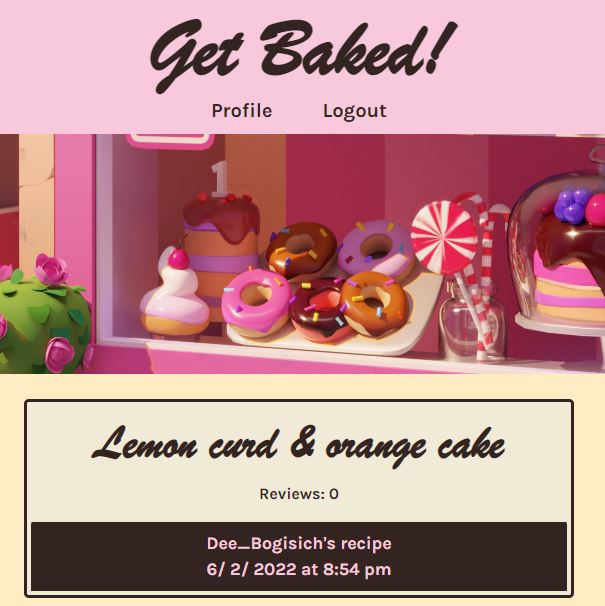

# Get Baked

## Purpose
An application for people who bake to share their recipes. Users are able to make posts and upvote other posts. Users are also able to post reviews on other recipes, allowing them to give positive or negative feedback on the recipe. Users will be able to view recipes and reviews without logging on, but to be able to make a post or leave a review, the user must sign up or log in.

## Built with
* GraphQL
* React.js
* Node.js
* Express.js
* Apollo Server
* MongoDB and Mongoose ODM
* JSX and JWT
* Reactstrap CSS

## First Look

## Github repository
https://github.com/aimtruong/get-baked

## Link to application
https://afternoon-fjord-21260.herokuapp.com/

## Contribution
Aimee Truong,
Charles Peace,
Dillon Roth,
Tyler Beck
